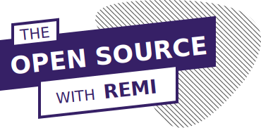

<a href="http://myopensourcejourney.com/">
    <p align="center">
        
    </p>
</a>

The concept is simple, **every two weeks** I choose a contribution to Open Source that I made that I find quite complete and particularly interesting to present to you.   
This is also an opportunity for me to introduce you to some Open Source projects.

The idea is to discover the benefits of contributing to Open Source through concrete examples.

This website is built using [Docusaurus 2](https://v2.docusaurus.io/), a modern static website generator.

## Installation

```console
yarn install
```

## Local Development

```console
yarn start
```

This command starts a local development server and open up a browser window. Most changes are reflected live without having to restart the server.
